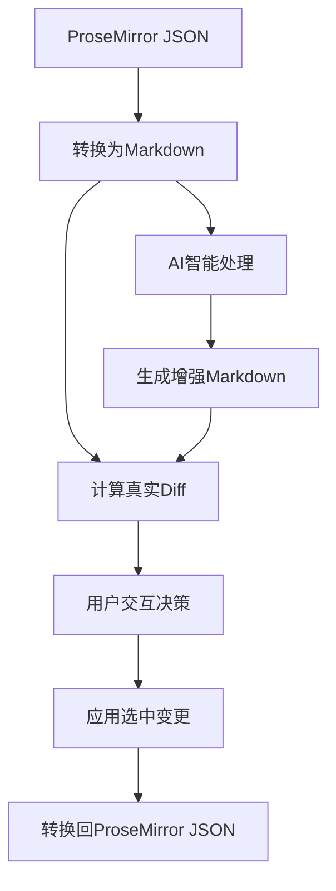

# 🤖 AI 功能设置指南

## 概述

本项目现在支持真实的AI处理功能，可以对Markdown文档进行智能增强和改进。新的AI工作流程包含：

1. **输入 ProseMirror JSON** - 输入或编辑你的文档
2. **AI 智能处理** - 使用真实的AI模型分析和增强内容
3. **可视化Diff对比** - 类似VSCode Git diff的界面
4. **交互式决策** - 逐个接受或拒绝每项变更
5. **应用变更** - 生成最终的ProseMirror JSON

## 🔑 API 密钥配置

### 获取 Inception Labs API 密钥

1. 访问 [Inception Labs](https://api.inceptionlabs.ai)
2. 注册账号并获取API密钥
3. 复制你的API密钥

### 环境变量设置

在项目的 `example` 目录下创建 `.env.local` 文件：

```bash
# 进入example目录
cd example

# 创建环境变量文件
touch .env.local
```

在 `.env.local` 文件中添加以下内容：

```env
# Inception Labs AI API 密钥
NEXT_PUBLIC_INCEPTION_API_KEY=your_api_key_here
```

**重要提示：**
- 将 `your_api_key_here` 替换为你的实际API密钥
- 如果没有API密钥，AI处理会使用备用增强功能（基本的模拟改进）

## 🚀 使用方法

### 启动应用

```bash
cd example
npm install
npm run dev
```

打开 [http://localhost:3000](http://localhost:3000)

### 使用AI工作流程

1. **选择"真实AI工作流"标签页**
2. **输入或编辑ProseMirror JSON** - 使用示例或输入你自己的文档
3. **点击"开始AI增强处理"** - AI会分析和改进内容
4. **查看差异对比** - 在类似VSCode的界面中查看所有变更
5. **决策变更** - 逐个接受或拒绝每项改进
6. **获取结果** - 复制或下载最终的ProseMirror JSON

## 📊 功能特性

### AI 增强能力

- **内容改进** - 优化语言表达，使其更清晰专业
- **结构优化** - 改进文档格式和组织结构  
- **细节补充** - 添加有用的说明和技术要点
- **代码示例** - 改进和更新代码示例
- **最佳实践** - 添加相关的技术建议

### Diff 对比界面

- **分栏视图** - 左右对比原始和增强文档
- **统一视图** - 单栏显示所有变更
- **语法高亮** - Markdown语法高亮显示
- **变更统计** - 实时显示待决策、已接受、已拒绝的变更数量

### 交互式决策

- **逐项审查** - 每个变更都可单独决策
- **批量操作** - 支持全部接受或拒绝
- **变更详情** - 显示每个变更的具体内容和位置
- **状态跟踪** - 清晰显示每项变更的状态

## 🛠️ 技术实现

### 核心技术栈

- **AI服务**: Inception Labs API (mercury-coder-small 模型)
- **Diff算法**: diff.js 库进行真实的文本差异计算
- **编辑器**: Monaco Editor 提供专业的代码编辑体验
- **UI框架**: React + Next.js + shadcn/ui

### 工作流程



## 🔧 故障排除

### API 相关问题

- **API密钥无效**: 检查环境变量文件和密钥格式
- **请求失败**: 确保网络连接正常，检查API服务状态
- **上下文限制**: 对于很长的文档，AI会自动优化内容长度

### 备用功能

如果AI处理失败，系统会自动使用备用增强功能：
- 添加基础的格式改进
- 插入常见的最佳实践建议
- 保持原有内容结构不变

### 开发环境

```bash
# 查看实时日志
npm run dev

# 构建生产版本
npm run build

# 类型检查
npm run type-check
```

## 📝 使用示例

### 输入示例

```json
{
  "type": "doc",
  "content": [
    {
      "type": "heading",
      "attrs": { "level": 1 },
      "content": [{ "type": "text", "text": "API Documentation" }]
    },
    {
      "type": "paragraph", 
      "content": [{ "type": "text", "text": "This is our API." }]
    }
  ]
}
```

### AI增强后可能的输出

- 添加更详细的API描述
- 插入认证说明部分
- 补充错误处理文档
- 改进代码示例
- 添加最佳实践建议

## 🎯 未来计划

- [ ] 支持更多AI模型 (OpenAI, Claude, etc.)
- [ ] 批量文档处理功能
- [ ] 自定义AI提示模板
- [ ] 历史版本管理
- [ ] 协作编辑功能

---

如有问题或建议，请在项目中提交 Issue 或 PR！🚀
